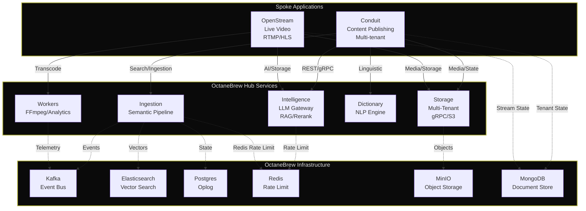

# Hey there 👋

I'm Shubham - Engineering Manager by profession and Distributed Systems Architect by passion with 8+ years building cloud-native and AI integrated platforms that scale.

**Currently Building:** 

**[OctaneBrew Platform](http://octanebrew.dev/):** Enterprise-grade hub-and-spoke infrastructure powering AI-driven content networks and real-time video delivery.

**[Conduit](https://conduit.octanebrew.dev/):** Multi-tenant content publishing platform with database-per-tenant isolation, offline first responsive design, integrated AI powered summary and semantic search.

**[OpenStream](https://openstream.octanebrew.dev/):** Real-time video streaming platform with RTMP ingestion, sub-second HLS delivery, WebSocket chat, and VOD archival.

**Past:** Led engineering team, shipped enterprise search, AI-powered semantic search, distributed systems processing 1M+ documents/day, and 80%+ relevancy gains through RAG pipelines for 1,000+ enterprise tenants.

**Skills I bring:** Team leadership • Distributed systems • AI/ML platforms • Semantic search • Multi-tenancy • High-scale infrastructure

---

## 🛠️ Tech Stack

### Languages

### Frontend

### Backend & APIs

### Communication & Protocols

### Databases & Storage

### Infrastructure & CI/CD

### Cloud

### AI & ML

### Observability

---

## 📈 What I Do

**Leadership & Strategy**
- Lead high-performing engineering teams
- Career growth frameworks & mentorship
- Agile execution (95% on-time releases)
- Cross-functional collaboration (Product, Data Science, UX)

**Architecture & Systems**
- Design distributed systems (Hub-and-Spoke, Orchestration, Event-Driven, CQRS)
- Semantic search & AI driven RAG pipelines
- High-throughput ingestion capable architecture
- Resilience patterns (Circuit breakers, Oplog, Rate limiting)

---

## 💡 OctaneBrew Platform

**Enterprise-grade distributed infrastructure** abstracting AI orchestration, content enrichment, and multi-tenant storage into centralized services.

**Architecture:** Hub-and-Spoke pattern with 6 core services + 2 downstream applications

### System Architecture

### Core Hub Services

**🧠 Intelligence** - AI Gateway with multi-provider orchestration (Gemini, OpenAI), FlashRank reranking, query intelligence, and Redis-backed rate limiting

**⚡ Ingestion** - Two-pass content enrichment (Kafka + Elasticsearch + PostgreSQL) with persistent Oplog pattern handling 1M+ documents/day

**💾 Storage** - Multi-tenant S3-compatible gRPC service with dynamic provisioning and granular ACL policies

**📚 Dictionary** - Linguistic analysis engine (spaCy, TextBlob) with multi-language support and grammar checking

**🎬 FFmpeg Worker** - Stateless transcoding mesh with Kafka consumer groups for horizontal scaling

**📊 Analytics** - ClickHouse-backed telemetry warehouse with 90-day TTL and bulk-write patterns

### Downstream Applications

**📝 Conduit** - Multi-tenant content network with database-per-tenant isolation, semantic search, offline first responsive design, integrated AI powered summary, semantic search and 10 dynamic themes

**🎥 OpenStream** - Real-time video platform with RTMP ingestion, HLS delivery, WebSocket chat, and sub-second latency

---

## 📈 Impact Metrics

**System Performance:**
- 99.99% uptime across all services
- 1M+ documents/day throughput
- 80%+ search relevancy (from 15% via AI Powered RAG)
- 50% MTTR reduction

**Team Leadership:**
- 50% YoY retention improvement
- 95% on-time release cadence
- 50%+ engineering velocity gains
- 25% support escalation reduction

**Scale:**
- 1,000+ enterprise tenants
- 30+ Enterprise search connector integrations (Google Drive, SharePoint, ServiceNow etc)

---

## 💼 Experience Highlights

- **Architected enterprise search & RAG ingestion pipelines** for 1,000+ tenants, driving search relevancy from 15% to 80%+ through zero-downtime migration from keyword to AI-powered retrieval augmented generation based search

- **Led distributed ingestion platform design** (Kafka + S3 + microservices) processing more than 1M+ documents/day with fault-tolerant retries, persistent Oplog patterns, and distributed rate limiting for enterprise-scale content enrichment

- **Delivered AI-powered conversational search & LLM-based summarization** with built-in guardrails, improving answer precision by 60% and reducing support escalations by 25% through semantic understanding and query intelligence

- **Scaled enterprise search to 30+ connectors** (Google Drive, SharePoint, ServiceNow, Box) with permission-aware unified search, ACL enforcement, and real-time synchronization for cross-platform content discovery

- **Built and led high-performing engineering teams** (5-10 engineers) with career growth frameworks and 1:1 mentorship programs, achieving 50% YoY retention improvement and 95% on-time release cadence

- **Established observability and CI/CD automation** reducing MTTR by 50% and doubling deployment frequency through Prometheus/Grafana monitoring, distributed tracing, and automated testing pipelines

- **Architected cloud-native SaaS platforms** with microservices patterns, Agile execution (25% timeline reduction), and optimized distributed systems achieving 50%+ server response time improvements

